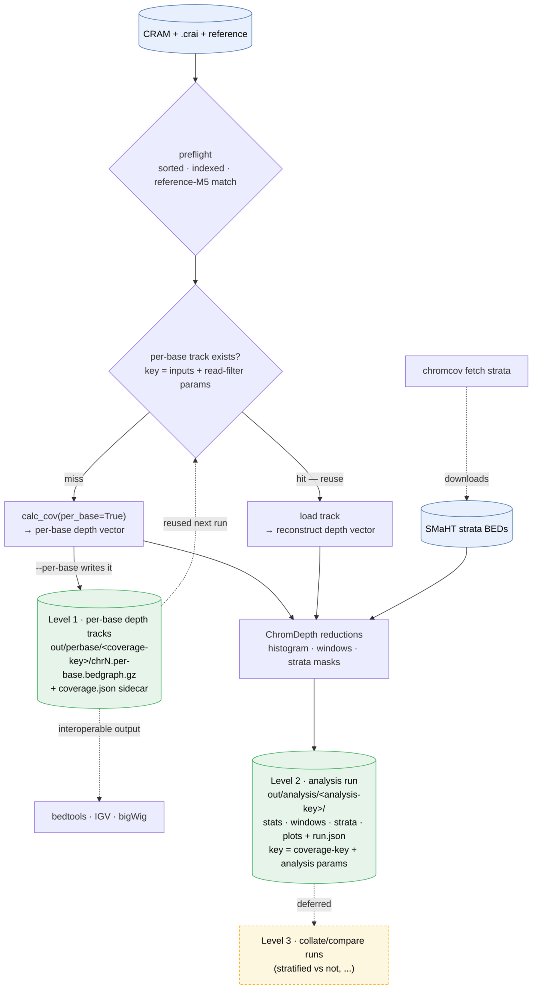
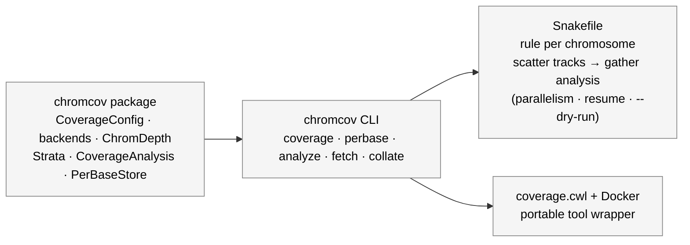

# chromcov workflow

Coverage is computed once and reused. The pipeline is **three derivation levels**,
each writing real, content-addressed output files, so a later call checks what
already exists and picks up where it left off (the "trickle-down" reuse).

## Data flow + reuse

**Why the keys differ per level.** The expensive step (per-base depth) depends only
on the *inputs + read-filter params* — so its key ignores window size, strata, or
copy-number settings. Changing `--window` or adding `--strata` therefore reuses the
same Level-1 tracks and only re-runs the cheap Level-2 reductions. That's what makes
"stratified vs unstratified" a fast comparison: two Level-2 runs off one Level-1 key.

**`coverage` (the deliverable) is the shortcut path:** it takes `per_base=False`,
sums aligned bases straight to `mean = bases / length`, and never builds the vector
or the tracks — fast, for the headline table (and the CWL contract).

## Orchestration layers

The same steps are usable three ways: call the library, run the CLI, or let an
engine drive the CLI. The per-base tracks are the file substrate an engine checks.

- **Built-in reuse** (the decision diamond above) makes `chromcov` self-contained —
  no engine needed to get incremental behavior.
- **Snakemake** scatters one `chromcov perbase --chrom N` per chromosome (free
  parallelism + resume), then gathers into one `chromcov analyze` that reuses the
  tracks. It imports `chromcov` to compute the deterministic keys, so its rule
  outputs land on the exact same content-addressed paths.
- **CWL** wraps `chromcov coverage` as a portable, Dockerized tool for the SMaHT
  pipeline world (the JD's stated target).
